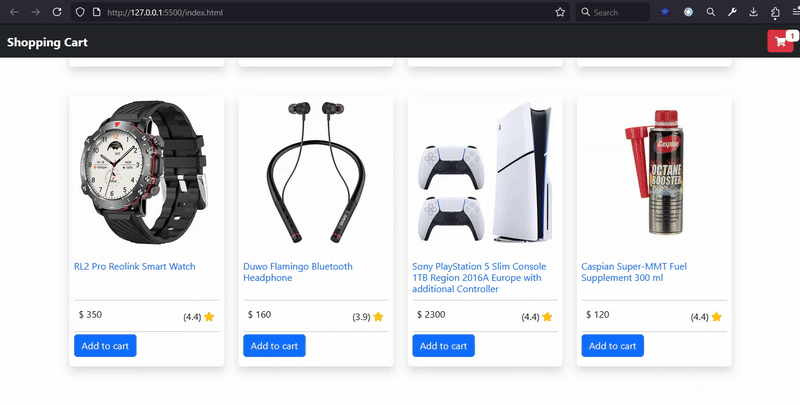
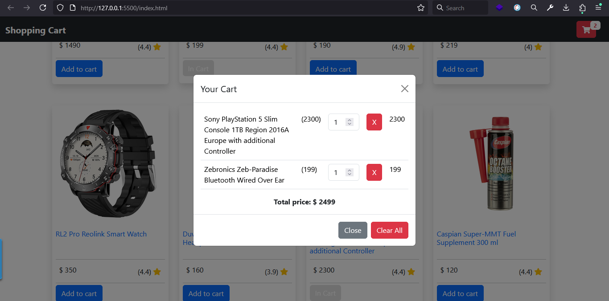

# Shopping Cart (Vanilla JavaScript)

A small, client-side shopping cart demo built with **Vanilla JavaScript**, Bootstrap and LocalStorage.  
Add products to the cart, change quantities, remove items, and clear the entire cart — all without a backend. The project follows a simple OOP structure (`Products`, `UI`, `Storage`) to separate responsibilities.

---

## 🔥 Features

- Display product grid (data from `products.js`)
- Add product to cart (disable button after adding)
- View cart in a Bootstrap modal
- Update item quantity (live update & persist to LocalStorage)
- Remove individual items
- Clear all items
- Grand total calculation
- Cart item count in navbar
- Code organized with small classes (Products / UI / Storage)

---

## 📁 Project structure
shopping-cart/
├── index.html # main page
├── bootstrap.js # local bootstrap bundle (or CDN)
├── style.css # some styles
├── script.js # main app (ES module)
├── products.js # product data (exported array)
├── assets/ # images, GIFs, screenshots 
└── README.md # description

## 🚀 Live Demo


## 🛠 How it works (quick overview)


1. **Products List** – `products.js` exports `productsList`.
2. **Get Products** – `Products.getProducts()` returns the list.
3. **Render UI** – `UI.displayProducts()` creates product cards.
4. **Add to Cart**  
   - Reads `inCart` from LocalStorage (`Storage.getCart()`).
   - Adds product with `quantity` and `totalPrice`.
   - Saves cart with `Storage.saveCart()`.
   - Updates UI via `UI.displayProductsCart()`.

5. **Cart Interactions**
   - Change quantity → Update cart & total.
   - Delete item → Remove from cart.
   - Clear all → Empty cart & refresh UI.

## 🖼️ Preview




```bash
git clone https://github.com/sajjad7181/shopping-cart.git
cd shopping-cart
open index.html
```

### 👨‍💻 Author
Made with ❤️ by [Sajjad Hosseinzadeh](https://github.com/sajjad7181)
